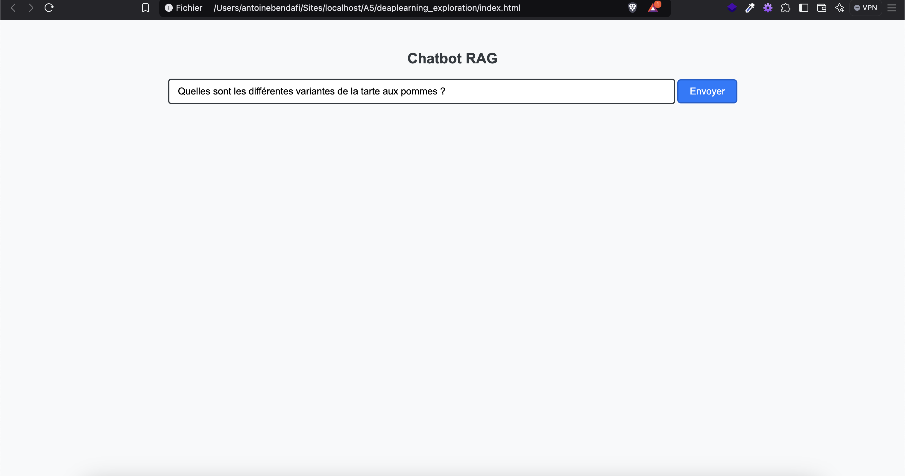
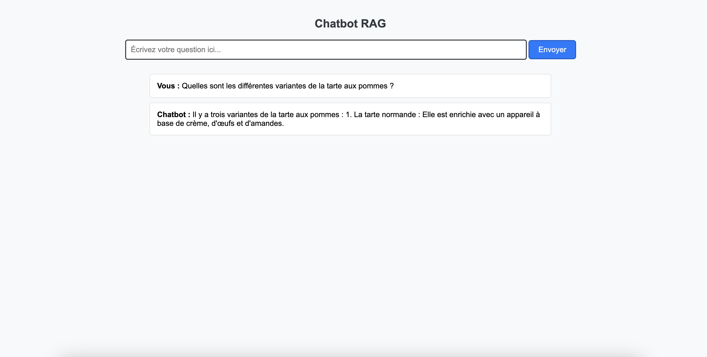

# Exploration - Deep Learning

#  1️⃣ Notebook 1 : modèle PyTorch sur un dataset de chiffres manuscrits

## Objectifs :
- **Préparer les données** : Charger et prétraiter le dataset MNIST.
- **Construire le modèle** : Définir une architecture de réseau de neurones en utilisant PyTorch.
- **Entraîner le modèle** : Utiliser une boucle d'entraînement pour ajuster les poids du modèle.
- **Évaluer le modèle** : Tester le modèle sur des données de test et évaluer sa performance.
- **Visualiser les résultats** : Afficher des exemples de prédictions du modèle.

### Contenu du Notebook :

1. **Importation des bibliothèques** :
   - Importation de PyTorch et des modules nécessaires (`torch`, `torch.nn`, `torch.optim`, `torchvision`).

2. **Préparation des données** :
   - Chargement et transformation du dataset MNIST en utilisant `torchvision.datasets` et `torchvision.transforms`.
   - Création des DataLoader pour les ensembles d'entraînement et de test.

3. **Construction du modèle** :
   - Définition d'un réseau de neurones simple avec des couches entièrement connectées en utilisant `torch.nn`.

4. **Entraînement du modèle** :
   - Définition de la fonction de perte (`CrossEntropyLoss`) et de l'optimiseur (`AdamW`).
   - Implémentation de la boucle d'entraînement pour ajuster les poids du modèle.

5. **Évaluation du modèle** :
   - Implémentation de la boucle de test pour évaluer la performance du modèle sur l'ensemble de test.

6. **Visualisation des résultats** :
   - Affichage d'exemples de prédictions du modèle avec les labels réels et prédits en utilisant `matplotlib`.

# 2️⃣ Notebook 2 : LSTM avec Tokenisation BPE

## 📝 Objectif :
Créer un modèle **LSTM** (Long Short-Term Memory) qui apprend à générer du texte en s’appuyant sur une **tokenisation avancée** (BPE - Byte Pair Encoding). Cela permet de mieux gérer les mots inconnus et de réduire la taille du vocabulaire.

## 🚀 Résumé :
- **Prétraitement des données** : transformation du texte en une suite de nombres avec **SentencePiece**.
- **Construction du modèle LSTM** :
  - Une première couche qui transforme chaque nombre en une représentation plus riche (**embedding**).
  - Un réseau LSTM qui apprend à anticiper la suite des phrases.
  - Une dernière couche qui prédit le mot suivant en lui attribuant une probabilité.
- **Entraînement** : le modèle s’ajuste en comparant ses erreurs et en les corrigeant à chaque passage.
- **Génération de texte** :
  - On donne un début de phrase au modèle.
  - Il devine progressivement les mots suivants.

## ⚙️ Étapes d’exécution :
1. **Lancer le notebook pour charger et préparer les données.**  
2. **Lancer l'entraînement du modèle LSTM.**  
3. **Tester la génération de texte avec `generate_text_bpe()`.**  
4. **Observer comment le modèle produit des phrases cohérentes au fil des entraînements.**

---

# 3️⃣ Notebook 3 : Transformer

## 📝 Objectif :
Créer un **modèle Transformer** qui génère du texte en comprenant **tout le contexte en même temps**, contrairement à un LSTM qui lit le texte **mot après mot**.

## 🚀 Résumé :
- **Compréhension du contexte global** : Chaque mot de la phrase "regarde" tous les autres pour mieux comprendre sa place et son sens.
- **Construction du Transformer** :
  - Une première couche qui transforme chaque mot en une représentation compréhensible (**embedding**).
  - Un mécanisme d’**attention** qui fait le tri dans les mots importants pour construire la phrase.
  - Un **décodeur** qui génère le texte, mot après mot, en prenant en compte tout ce qui a été écrit avant.
- **Entraînement** :
  - Le modèle apprend en ajustant ses prédictions et en minimisant ses erreurs.
- **Génération de texte** :
  - À partir d’un mot donné, il construit une phrase en choisissant à chaque étape le mot le plus logique.

## ⚙️ Étapes d’exécution :
1. **Lancer l'entraînement du Transformer sur les données tokenisées.**  
2. **Tester la génération avec `generate_text_transformer()`.**  
3. **Comparer la qualité des phrases générées avec celles du modèle LSTM.**

---

## 🔎 Différence clé entre LSTM et Transformer :
✅ **LSTM** → Lit les mots **un par un** et mémorise ceux d’avant pour anticiper la suite.  
✅ **Transformer** → Comprend **toute la phrase d’un coup** et choisit le mot suivant en analysant l’ensemble du contexte.

Globalement le **Transformer** est plus performant pour générer des phrases cohérentes, mais il est plus lent à apprendre.


# 4️⃣  Notebook 4 : RAG - Chatbot Intelligent avec Recherche Documentaire et Synthèse Vocale en local 

Ce **pipeline RAG** (**Retrieval-Augmented Generation**) permet d'**améliorer la précision des réponses d'un modèle de langage** en le forçant à **ne pas se baser uniquement sur sa donnée d'entraînement**, mais à **synthétiser des informations extraites de documents**. Grâce à ce processus, les réponses sont **plus précises, actualisées et adaptées aux documents fournis dans le fichier  ```documents.zip``` et à mettre dans un dossier ```/data```** vous aurez donc deux fichiers `connaissances.txt` et  `document.pdf`.

## 🛠️ Fonctionnalités
- 🔍 **Recherche augmentée** : interroge des documents locaux (`connaissances.txt`, `document.pdf`) avant de générer une réponse.  
- 💡 **Modèle de génération Mistral 7B** (llama-cpp-python) exécuté **en local**.  
- 📚 **Stockage et recherche rapide d’informations avec ChromaDB**  pour récupérer les informations les plus pertinentes avant de générer une réponse.
  - 1️⃣ Premier lancement → L’index est créé et sauvegardé dans ```models/chromadb```
  - 2️⃣ Exécutions suivantes → L’index est directement rechargé depuis ```models/chromadb```, sans tout recalculer.
  → L’index c'est simplement une base de données optimisée qui stocke les versions vectorisées de `connaissances.txt` et de `document.pdf` , ce qui permet au modèle de rechercher rapidement des informations pertinentes avant de répondre et pas recalculer à chaque fois.

- 🌐 **API Flask** (`/chat`) qui gère la communication entre le modèle et l'interface web.  
- 🎤 **Synthèse vocale Bark** : **une voix pour la question, une autre pour la réponse**.  
- 🖥️ **Interface web (`index.html`) pour interagir avec le chatbot**.

---

## ⚡ Comment l’utiliser ?
1. **Lancer le Jupyter Notebook**  
2. **L'interface `index.html` sera générée automatiquement**  
3. **Ouvrir `index.html` dans un navigateur**  

4. **Poser une question (ex. : "Comment faire une tarte aux pommes ?")**  
5. **Le chatbot dans un premier temps répète la question après l'avoir intégrée puis la répète à voix haute, puis l'analyse des documents se lance, génère une réponse et la lit à voix haute également**  

---


## ✅ Questions de test pour vérifier le RAG
- ```Quelles sont les différentes variantes de la tarte aux pommes ?```  
- ```Comment faire une tarte aux pommes ?```  
- ```Quel est le secret d’une bonne tarte aux pommes ?``` 

---

## 💡 Améliorations possibles
- 🔊 **Utiliser une voix encore plus naturelle** (XTTS, Coqui-TTS...)  
- ☁️ **Déployer l’API Flask en ligne** pour l’utiliser à distance  

